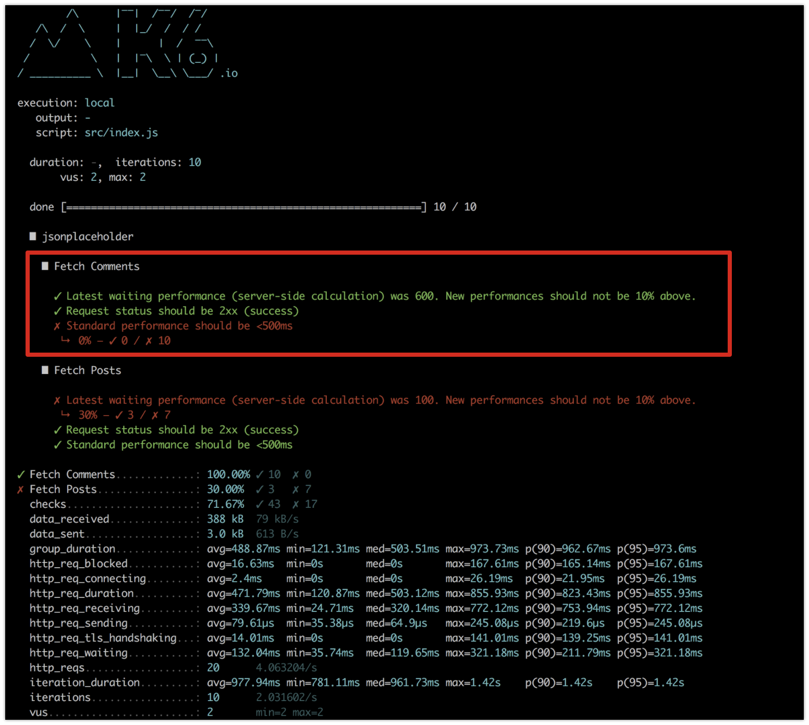
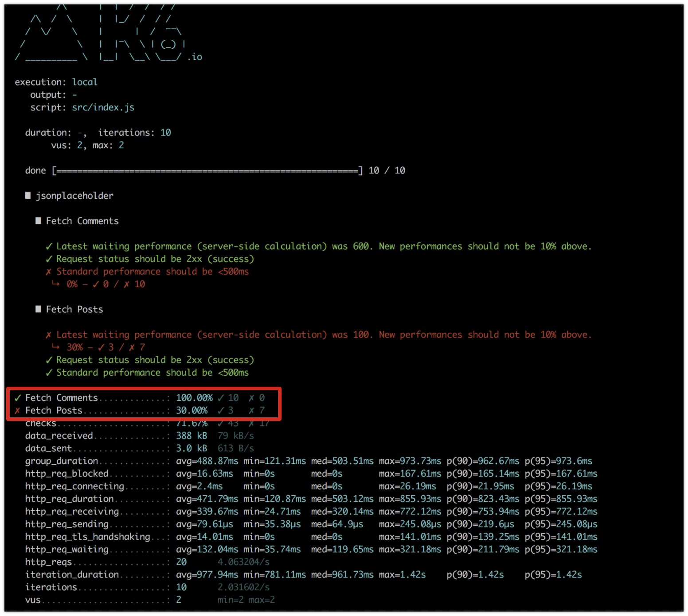

# Check your API performance while developing with k6

## Problem

One day on a mobile application project, we discovered one of the API route used by the application took 15 seconds to return a result. We priorized time to solve this problem, and improved it to 500ms! But a few days later, another team working on the same route, break the performance again to 10 seconds...

## Solution

We had to find a solution in order to prevent this from happening again, and **increase awareness about performance** into our teams.
That's how we discovered [k6](https://k6.io/). It allows us to:

* while developing, detect back-end performance problems before going to production;
* follow back end performance regularly with the team (developpers and business) on a graph.

You will get here tips to follow your back-end performance thanks to `k6`.
It took us ~1hour to get a first k6 test written following their [documentation](https://docs.k6.io/docs). But since our first test, while using it, we improved our utilisation of k6. We want to share it with you so it is easy and quick for you to get a good use of k6.

### Usage

**Problem**: We don't have any check or tests that make sure that our routes are and stay fast.

**Methodology**:

* Define a standard response time:
  how long you accept a route takes to return a response, above it the route will be considered KO. Discuss it with all your team, and change `STANDARD_RESPONSE_TIME` in [globalChecks](https://github.com/bamlab/performance-monitoring/blob/master/src/globalChecks.js#L1) (more about global checks just below which define if a route performance is OK or KO)

  > For example, we chose 500ms.

* Process:
  
  

### Installation

We decided to share with you a k6 sample repository as we have ours: https://github.com/bamlab/performance-monitoring

* Fork this repository and name it `{YOUR_ORGANIZATION_NAME}-performance-monitoring`
* Clone your new repo locally
* [Install k6](https://docs.k6.io/docs/installation)
* You're good to test

The folder is structured by API:

```bash
src
├── apiName1 # one folder per API
│   ├── tests # all tests are located in a tests folder
│   │   ├── fetchComments.js # one route tested per file
│   │   ...
│   └── index.js # a main index file grouping all API tests
├── apiName2
│   ├── tests
│   │   ├── fetchArticles.js
│   │   ...
│   └── index.js
...
```

You can run tests:

* one by one:

```bash
  k6 run src/{replace_by_your_API}/tests/{replace_by_your_test}.js
```

* by API:

```bash
  k6 run src/{replace_by_your_API}/index.js
```

* by project:

```bash
  export PROJECT={replace_by_your_project_name} && k6 run index.js
```

### Write a test

What we put in place to simplify test writing:

* **Global options**:
  When you run a test you can chose the number of virtual users and how many time you want to run the test.

  ```bash
  k6 run src/{replace_by_your_API}/tests/{replace_by_your_test}.js --vus 2 --iterations 10
  ```

  Here: 2 virtual users, 10 times

  > Trying different values for virtuals users made us aware that ours servers were not able to manage more than 10 simultaneous connections

  We defined [global options](https://github.com/bamlab/performance-monitoring/blob/master/src/globalOptions.js#L16-L17), used by default when you run tests by API, or by project.
  You can adapt it to your project requirements.

* All your tests will extends [BaseTest](https://github.com/bamlab/performance-monitoring/blob/master/src/BaseTest.js), like this all your tests will:

  * have the same checks ([globalChecks](https://github.com/bamlab/performance-monitoring/blob/master/src/globalChecks.js#L1)):

    * **ok status**: check the response status is successful (2xx)
    * **global performance**: check the route respect your standard response time
    * **latest performance**: check your latest modification of code didn't break the route performance

    

  * have the same [threshold](https://github.com/bamlab/performance-monitoring/blob/master/src/BaseTest.js#L10):
    green if the latest performance test is above 70% (for example here 7 tests over the 10 verify 'latest performance' test), red otherwise.

    

**To write your first test**, follow [contribute by adding new tests](https://github.com/bamlab/performance-monitoring/blob/master/documentation/contribute.md) (~10min).

## Next

Based on this sample k6 repository, we also put in place a script to check your back-end performance weekly.
A second article will come soon to allow you doing the same.

## Documentation

* [Getting started with k6](https://k6.readme.io/docs/welcome)
* [k6 options](https://k6.readme.io/docs/options)
