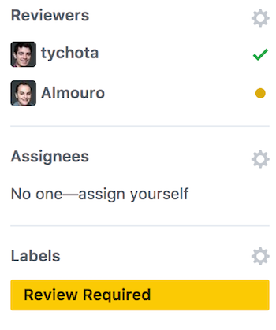

# [MO] Contributing

## Owner: [Yann Leflour](https://github.com/yleflour)

## Prerequisites:

- You have cloned [the repository](https://github.com/bamlab/dev-standards) locally
- You have a [markdown/text editor](/editors/vscode/setup-vscode.mo.md)

## Steps:

### 1. Writing *(Variable time)*

- For a Method of Operation please read [the following standard](/contributing/mo.s.md)
- For a Standard please read [the following standard](/contributing/standard.s.md)
- Create a branch and a pull request

> **Check:** Your article is visible in the [pull requests list](https://github.com/bamlab/dev-standards/pulls)

### 2. Review *(~3min)*

- Assign 2 contributors for review
- Add the *Review Required* label

> **Check:** Your PR side bar should look like this
> 

### 2bis. Fixing *(Variable time)*

When a reviewer has reviewed your article he may give you some feedback.

- Correct what needs to be corrected
- Answer the comments which don't need fixing
- Add the *Review Required* label

> **Check:** Every comment is either deprecated or answered on Github and the label is *Review Required*

### 3. Publishing *(~0min)*

- Once all reviews are ok, the last reviewer will merge your pull request and delete your branch
- Publishing your branch will be automatic

> **Check:** Your article can be found on [the Gitbook website](https://bamtech.gitbooks.io/dev-standards/)

> **Troubleshooting:** Contact [Tycho](https://github.com/tychota)
