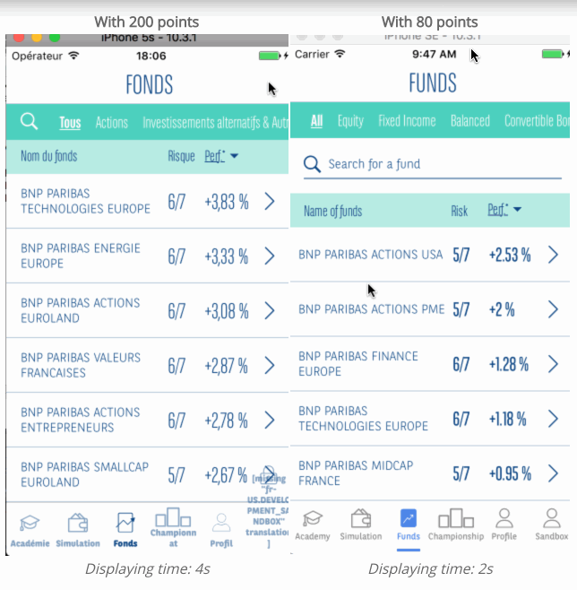

# A table or a chart on my project takes to much time to render

## Owner: [Justine Mignot](https://github.com/justinemignot)

## Do you need to display all data you are displaying currently ?

### Chart (Owner: [Thibaut Guedou](https://github.com/thibautguedou3))

If your user only needs 50 points, do not display 500!
Ask yourself this question: “which data do I need to display?”. If the data you receive from your API call or your SQL request contains 200 points, it does not necessarily means that you have to display these 200 points.
For example if you only need half of the data, when performing your api call, create a small function that will only store half of the points in your redux store. It was implemented on Investo project and it allowed to gain 2s in the displaying time of pages.

### Table

Ask yourself the same question as for charts: “which data do I need to display?”. We had the example on a project of a table of 500 lines. We were at first rendering it all, it was very slow (more than 20 seconds to render).
The point was that users would never scroll down the 500 lines, because there was a search functionality.
It was therefore decided to display only 50 lines at first and add a 'See more' button. That was a win because users never clicked on this button, proof that rendering those 500 lines was only a performance loss.

## I need to display a high quantity of data

### Pagination

Maybe you wonder: should I paginate on front or backend ?

- Paginate back only if the cause of slowness is the time of backend request (more than 2s).
  If you paginate your route, you must use lazy loading (you can ask [Guillaume Renouvin](https://github.com/GuillaumeRenouvin) about it)
- Otherwise, paginate front if you want to minize elements to display and so gain on rendering time.

### Which React Native should I choose ?

Some React Native elements render items lazily, just when they are about to appear, and removes items that scroll way off screen to save memory and processing time: [FlatList](https://facebook.github.io/react-native/docs/flatlist), [SectionList](https://facebook.github.io/react-native/docs/sectionlist), [VirtualizedList](https://facebook.github.io/react-native/docs/virtualizedlist)

DO NOT USE `ScrollView`: it simply renders all its react child components at once, so it has a big performance downside!

### And for React ?

To display a big list with React, a great tool exists: [react-virtualized](https://bvaughn.github.io/react-virtualized/#/components/List).
But the point is that implementing it add a not negligible complexity on your tickets.
The best would be to know at the beginning of the project the order of size of the data to display to include it in ticket complexity if necessary.
