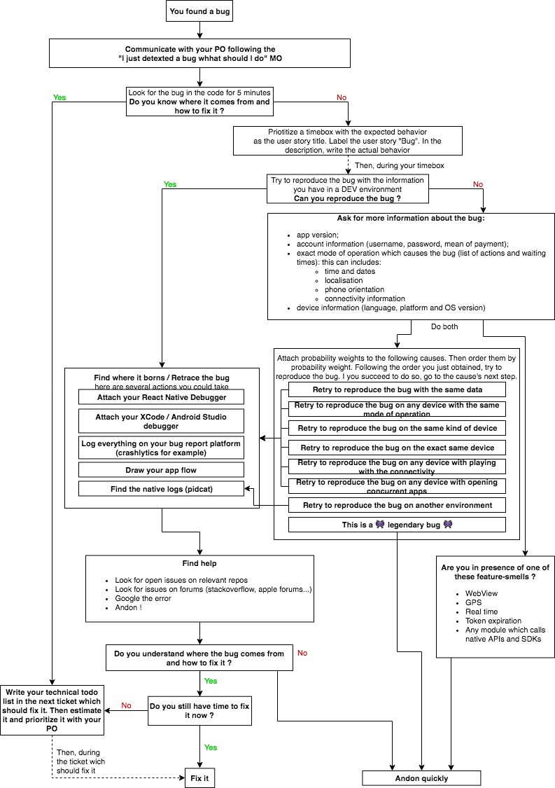

# [MO] How to react to and analyse a bug on a React-Native project ?

## Owner: [Thomas Pucci](https://github.com/tpucci)

Cheatsheet is available at the end of the MO.

## Prerequisites

* 🐛 You have a bug, obviously.
* ⚛️ It lives in a React-Native project.

## Scrum preamble

You just spotted a bug. What should you do ?



For M33 People:

First thing first: communicate with your Product Owner and follow this [mode of operation](http://blog.m33.network/2017/07/i-just-detected-a-bug-what-should-i-do/).



### Look for the bug in the code for 5 minutes

If you find it and you know how to fix it, write your technical todo list in the next ticket which should fix it. Then estimate it and prioritize it with your PO.

If not, follow this guide.

### You don't know where it comes from and how to fix it

Priotitize a timebox with the expected behavior
as the user story title. Label the user story **"Bug"**. In the description, write the actual behavior.
During your timebox follow the next steps.

## Steps

### 1. Try to reproduce the bug with the information you have in a DEV environment

You can reproduce the bug. Great! **Go to step 2.**

You can't reproduce the bug. Bummer. This is one of the hardest to fix.

### 1.1 Ask for more information

Ask for the person who spotted the bug all information of its environment. Such as:

* app version;
* account information (username, password, mean of payment);
* exact mode of operation which causes the bug (list of actions and waiting times): this can includes:
  * time and dates
  * localisation
  * phone orientation
  * connectivity information
* device information (language, platform and OS version).

Then, attach probability weights to following hypothesis:

* the bug is caused by a certain data
* the bug is caused by a certain mode of operation
* the bug is caused by a certain kind of device
* the bug is caused by a certain version of OS
* the bug is caused by a certain group of devices
* the bug is caused by a certain connectivity
* the bug is caused by other applications being opened at the same time
* the bug is caused by a certain environment
* the bug is legendary

Finally, order the list by probability and jump to each of the step they refer to in the same order.

### 1.2 Retry to reproduce the bug with the same data

Put yourself in the same environement given by the bug oberver **on any device (any language, platform and OS)**:

* checkout the version of the bug observer;
* repeat its mode of operation with its account information and its data;

Can you reproduce the bug ? Yes, **go to step 2**. No, proceed.

### 1.3 Retry to reproduce the bug on any device with the same mode of operation

Put yourself in the same environement given by the bug oberver **on any device (any language, platform and OS)**:

* checkout the version of the bug observer;
* repeat its mode of operation with any account/data;

Can you reproduce the bug ? Yes, **go to step 2**. No, proceed.

### 1.4 Retry to reproduce the bug on the same kind of device

Put yourself in the same environement given by the bug oberver **on the same kind of device**.
This means your platform (iOS/Android) and your OS version match the bug observer's environment:

* checkout the version of the bug observer;
* run your app on a device/emulator with the same Platform, the same language, **and the same OS version**.
* repeat its mode of operation with its account information;

Can you reproduce the bug ? Yes, **go to step 2**. No, proceed.

### 1.5 Retry to reproduce the bug on the exact same device

Ask for the bug observer device. Run the app on its device:

* checkout the version of the bug observer;
* run your app on the bug observer's device.
* repeat its mode of operation with its account information;

Can you reproduce the bug ? Yes, **go to step 2**. No, proceed.



**Scrum**

If you cannot access to the device, stop your timebox here. Inform your PO that you will continue this investigation later, when you can access the device.



### 1.6 Retry to reproduce the bug on any device with playing with the connectivity

Put yourself in the same environement given by the bug oberver **on any device (any language, platform and OS)**:

* checkout the version of the bug observer;
* repeat its mode of operation with any account/data;
* randomly manipulate your wifi and data connectivity;

Can you reproduce the bug ? Yes, **go to step 2**. No, proceed.

### 1.7 Retry to reproduce the bug on any device with opening concurrent apps

Put yourself in the same environement given by the bug oberver **on any device (any language, platform and OS)**:

* checkout the version of the bug observer;
* open concurrent apps (music, maps, phone);
* repeat its mode of operation with any account/data;

Can you reproduce the bug ? Yes, **go to step 2**. No, proceed.

### 1.8 Retry to reproduce the bug on another environment

Put yourself in the same environement given by the bug oberver **on any device (any language, platform and OS)**:

* checkout the version of the bug observer;
* repeat its mode of operation with any account/data;
* repeat its mode of operation with its account/data;

Can you reproduce the bug ? Yes, **go to step 2.4**. No, proceed.

### 1.9 This is a 👾 legendary bug 👾

Sorry, you are now on your own. You can go to step 2 and get inspired or stop your timebox. We hope you can fix this bug and then, do not forget to improve this article in order to help future readers.

 **CHECK**

You can reproduce the bug.



## 2. Find where it borns

Some features on React Native are more error-prone than others. If the bug seem related to one of the following items, it is a symptom that indicates a difficult issue.



**Feature smells**

* WebView
* GPS
* Real time
* Token expiration
* Any module which calls native APIs and SDKs

If you are in presence of one of these feature-smells, do not wait too much to andon.



In order to find the bug, you should be comfortable with these practices:

* debug your React Native app with the JS debugger;
* debug your Redux reducers and actions creators with Redux dev tools;
* debug your React components with React dev tools;
* andon;
* debug your Native app with XCode/Android studio debuggers.

### 2.1 Attach your debuggers

Attach all your debuggers to your running app in a DEV environment:

* attach your JS debugger;
* attach your redux debugger;
* attach your React debugger;
* attach your Android Studio/XCode debugger;

 **CHECK**

You see the app logs in all your debugger.



### 2.2 Reproduce the bug

Reproduce the bug. It raises an error or an unexpected behavior in your consoles/inspectors.

 **CHECK**

You see the error.



### 2.3 Retrace the bug

Find the source of the bug. When blocked:

* check if there are **open issues** on relevant repos;
* andon;
* with dichotomy, delete / add lines of code and isolate where the bug come from. You can either create a project from scratch and isolate the bug.



When you are looking for a bug in React Native, it can either:

* come from the JS part
* come from the Native part

In any case, check if there are **open issues** on relevant repos. If the bug comes from closed source (such as iOS SDK), check open problems on the code owner problem reporting platform. For iOS, find reported problems and changelog on Releases Notes.

[iOS 11.3 Releases Notes](https://developer.apple.com/library/content/releasenotes/General/RN-iOS-11.3/index.html#//apple_ref/doc/uid/TP40017699)



If you understand where the bug comes from, **go to step 3**. Else, proceed to step **2.3**.

 **CHECK**

You understand where the bug comes from.



### 2.4 Read native logs

You have another chance to understand where the bug comes from: connect your device or your simulator and find your app logs. Look into these logs if their is something unexpected; then go back to step **2.3**.

## 3. Plan a solution

Now that you know where the bug comes from, write down all technical solutions which solve the bug.
Choose the most relevant one for your project with your architect.

 **CHECK**

You know how to solve the bug. You wrote the technical solution in your timebox or in a new ticket in the next sprint.



