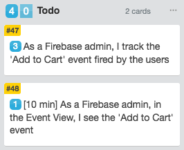
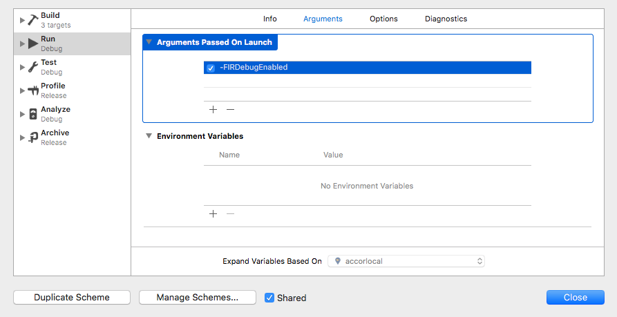

# [MO] Good practices to debug events in Firebase

## Owner: [Thomas Pucci](https://github.com/tpucci)

## Prerequisites

* [React Native Firebase](https://github.com/invertase/react-native-firebase) is installed on your project
* You want to track one event

## Scrum

Validating events tracking with Firebase should be done with two tickets:

1. You should have one ticket to send the event to Firebase which your PO will validate with a screenshot.
2. You should have a second ticket to track your event and its parameters on Firebase and save it (this ticket is dependant of the previous one and **can be treated one day after the first ticket is completed**).

_Example:_



## Steps

### Set up your device in debug mode (10min)

Choose to start with either Android or iOS. Once you've finished with an OS, switch to the other.

#### iOS

1. in Xcode, edit the product's scheme.



Go in **Product**, **Scheme ▶**, **Edit Scheme... ⌘<** or use the shortcut **⌘<**.



2. In the left menu, select **Run**. Select the **Arguments** tab.
3. In the **Arguments passed on launch** section, click the **+** icon (_Add items_).
4. Type in `-FIRDebugEnabled` and hit enter.
5. Close the modal.
6. Build your application and run it on your simulator or device.



 **CHECK**

1. In Firebase, in the left menu, go in **Analytics**, **Debug View**.
2. Select your application in the top menu.
3. Your debug devices count should print: **APPAREIL DE DÉBOGAGE: 1**



#### Android

1. Run your simulator or connect your device.

 **CHECK**

Running the command `adb devices` in your shell should display your device ID.

```bash
List of devices attached
emulator-5554	device
```



2. Run the following command: `adb shell setprop debug.firebase.analytics.app <app_identifier>`

 **CHECK**

1. In Firebase, in the left menu, go in **Analytics**, **Debug View**.
2. Select your application in the top menu.
3. Your debug devices count should print: **APPAREIL DE DÉBOGAGE: 1**





How to find your `<app_identifier>` ?
* dev: in your `build.gradle`
* staging: in you `env.staging`
* production: in your `env.production`



### Use react-native-firebase API to track events (10min)

1. Use `logEvent` method.

_Exemple:_

```js
import firebase from "react-native-firebase";

const firebaseAnalytics = firebase.analytics();

export default class Analytics {
  static trackEvent(eventName, params) {
    firebaseAnalytics.logEvent(eventName, params);
  }
}
```

2. In your simulator or on your device, do the action which rises the event.

 **CHECK**:

1. In Firebase, in the left menu, go in **Analytics**, **Debug View**.
2. Select your application in the top menu.
3. You should see your events with their parameters
   



2. (bis) Do the same for Android and iOS.

### Complete your task (10min)

3. Take a screenshot of the event(s) **with their parameters** your ticket aims to implement. (To see the parameters received by Firebase, click on one event)

4. Commit your work **except all modifications to `<your_project>.xcodeproj`**

5. Create your pull request

6. Once merged, attach your screenshot to your first ticket which aims to track the event.

7. Deploy your changes, and do the action which rises the event on your Staging Application.

8. Put your first ticket to validation and add a due date to the second ticket to tomorrow.

### Check that your event is tracked and track your event parameters (1 day waiting + 10min)

9. In Firebase, in the left menu, go in **Analytics**, **Events**.

10. Check that your event is in the list. If not, either something went wrong in the previous steps either Google has not reported any events yet (or Google is down).

11. To track parameter, click on your event then on the 'Add parameters' button.

## (Optionnal) remove debug mode (10min)

#### iOS

Either stash your changes on `<your_project>.xcodeproj` or do the following:

1. in Xcode, edit the product's scheme.



Go in **Product**, **Scheme ▶**, **Edit Scheme... ⌘<** or use the shortcut **⌘<**.



2. In the left menu, select **Run**. Select the **Arguments** tab.
3. In the **Arguments passed on launch** section, remove `-FIRDebugEnabled` click the **+** icon (_Add items_).
4. Type in `-FIRDebugDisabled` and hit enter.
5. Close the modal.
6. Build your application and run it on your simulator or device.


 **CHECK**

1. In Firebase, in the left menu, go in **Analytics**, **Debug View**.
2. Select your application in the top menu.
3. Your debug devices count should print: **APPAREIL DE DÉBOGAGE: 0**



#### Android

1. Reload the app in your simulator or your device.

 **CHECK**

Running the command `adb devices` in your shell should display your device ID.

```bash
List of devices attached
emulator-5554	device
```



2. Run the following command: `adb shell setprop debug.firebase.analytics.app .none.`

 **CHECK**:

1. In Firebase, in the left menu, go in **Analytics**, **Debug View**.
2. Select your application in the top menu.
3. Your debug devices count should print: **APPAREIL DE DÉBOGAGE: 0**


