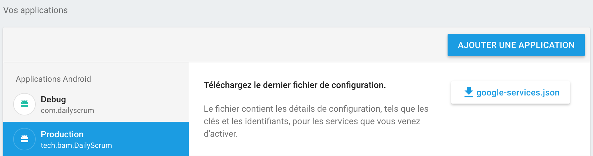
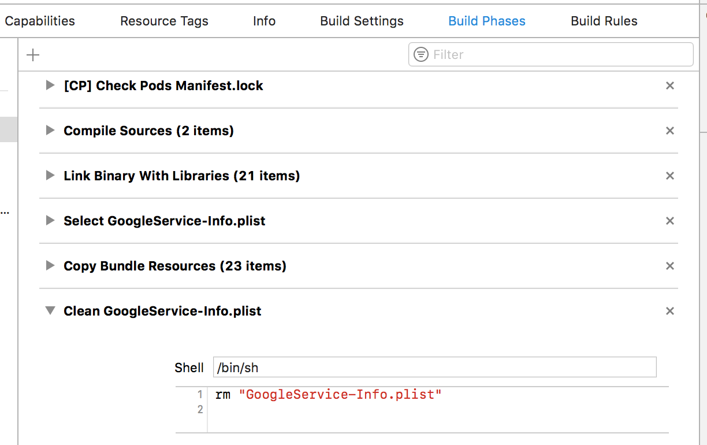

# [MO] Setup Firebase on iOS/Android with multiple environments *(~1h)*

## Owner: [Louis Lagrange](https://github.com/Minishlink)

Correcter: Thomas Pucci

## Prerequisites *(~30min)*

- [ ] An Android or iOS app with the Firebase SDK installed

  - For React Native apps, you can use [`react-native-firebase`](https://github.com/invertase/react-native-firebase):
    - [iOS](https://rnfirebase.io/docs/v3.2.x/installation/ios)
    - [Android](https://rnfirebase.io/docs/v3.1.*/installation/android)
- Be careful, when you're using specific modules of firebase, like analytics, you may have to add some `compile` to the `gradle` and some external pods


## Foreword

You can install and setup Firebase with two different ways:

|   | Javascript asynchronous setup | Native synchronous setup  |
|---|---|---|
|  Pros |  - 👍 No Native code is required<br> - ⏩ Setup is quick | - 🚀 In your application, you do not need to wait for firebase to instantiate each time you need it<br> - ✅ You can use Firebase Phone Authentication  |
|  Cons |  ⚠️ You **cannot** use this setup if you aim to use Firebase Phone Authentication as it requires the default Firebase app to be setup (meaning the native synchronous setup to be done: see the paragraph ℹ️ *Important note* [here](https://rnfirebase.io/docs/v3.2.x/core/initialize-apps)) | 📲 You need install native libraries  |

This MO aims to setup Firebase with the **Native synchronous setup**. For the **Javascript asynchronous setup** read the [docs here](https://rnfirebase.io/docs/v3.2.x/core/initialize-apps); and each time you need to call Firebase in your JS code, wait for the Firebase app initialization with `onReady()` method.

## Steps *(~30min)*

It's pretty straightforward to install Firebase when you have only one environment.
But what if you have multiple environments, such as `dev`, `staging` and `production`?
Here's a step-by-step guide.

### Android *(~10min)*
On Android, Firebase groups the different configurations in one file.

1. Go to the [Firebase console](https://console.firebase.google.com/)
2. Select your project
3. Click "Add an application", choose Android
4. Fill in the form (giving a name like `Staging`), click save, and close the window
5. Repeat steps 3 to 4 for all your environments
5. Download the `google-services.json` file
   1. Select one of the Android applications
   2. Click on "google-services.json"
6. Put `google-services.json` in your `app` folder (`android/app` in React-Native)
7. You might want to add `google-services.json` in your `.gitignore`



### iOS *(~20min)*
On iOS, there is one Firebase configuration file per environment.

1. Go to the [Firebase console](https://console.firebase.google.com/)
2. Select your project
3. Click "Add an application", choose iOS
4. Fill in the form (giving a name like `Staging`), click save
5. Download the configuration file `GoogleService-Info.plist` and rename it like `GoogleService-Info.{APP_IDENTIFIER}.plist`
   * Example: for `tech.bam.myApp.staging`, `GoogleService-Info.tech.bam.myApp.staging.plist`
6. Repeat steps 3 to 5 for all your environments
7. Duplicate your configuration file for dev environment two times and rename them like so:
   * `GoogleService-Info.plist`
   * `GoogleService-Info..plist`
8. Put all your configuration files in the root of your iOS app folder (`ios` in React-Native)
9. Make sure that your app identifier is injected in your `.pbxproj`. For example, if you're using Fastlane, add a `update_app_identifier` step like:
```ruby
update_app_identifier(
  xcodeproj: xcodeproj_full_path,
  plist_path: plist_full_path,
  app_identifier: ENV['APP_IDENTIFIER']
)
```
If you bootstrapped your project with BAM generator, use the following in the iOS build lane:
```ruby
update_app_identifier(
  xcodeproj: xcodeproj,
  plist_path: ENV['IOS_PLIST_PATH'],
  app_identifier: ENV['IOS_APP_ID']
)
```
10. In XCode, in `Build phases`, add a `Select GoogleService-Info.plist` build step before the `Copy Bundle Resources` step that contains:
```bash
cp "GoogleService-Info.plist" "GoogleService-Info.plist.bak"
cp "GoogleService-Info."$IOS_APP_ID".plist" "GoogleService-Info.plist"
```
11. In XCode, in `Build phases`, add a `Clean GoogleService-Info.plist` build step after the `Copy Bundle Resources` step that contains:
```bash
cp "GoogleService-Info.plist.bak" "GoogleService-Info.plist"
rm "GoogleService-Info.plist.bak"
```
12. Make sure that the `GoogleService-Info.plist` is listed in the resources of the `Copy Bundle Resources` step
13. You might want to add `GoogleService-Info.*.plist` in your `.gitignore`



## Troubleshooting

You can take a look at the commit that adds crash reporting and analytics in DailyScrum: [8005ce3](https://github.com/Minishlink/DailyScrum/commit/8005ce348cc61e9ad4550392fc08ae8a1bad8033)
